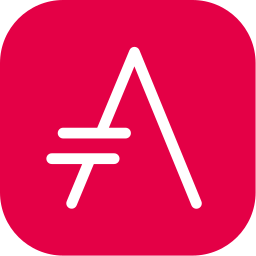

= Examples to test html & pdf versions of asciidoc
Author <author@email.com>
version, {version-label}: remark
//:doctype: article(Default), book, manpage, inline
:toc: left
:toc-title: Following https://docs.asciidoctor.org/asciidoc/latest/syntax-quick-reference
// to get buttons & menus
//
:icons: font
// Except when the role and options attributes are assigned values using their shorthand syntax (. and %, respectively), all other block attributes are typically separated by commas (,).
// compliance attributes
:attribute-missing: warn
// experimental: Enables Button and Menu UI Macros and the Keyboard Macro  DEFAULT is ON
:experimental:
// reproducible Prevents last-updated date from being added to HTML footer or DocBook info element. Useful for storing the output in a source code control system as it prevents spurious changes every time you convert the document. DEFAULT is ON
:header:
:reproducible:
:version-label: 2021-01-28
:release-version: release {version-label}

== intrisic attributes
[%hardbreaks]
header: {header}
doctype: {doctype}
backend: {backend}
backend-html5: {backend-html5}
doctype: {doctype}
docdate: {docdate}
docdatetime: {docdatetime}
doctime: {doctime}
// (0=UNSAFE, 1=SAFE, 10=SERVER, 20=SECURE).
safe-mode-level: {safe-mode-level} 
safe-mode-name: {safe-mode-name}

== compliance attributes
[%hardbreaks]
attribute-missing: {attribute-missing}
experimental: {experimental}
reproducible: {reproducible}

== cross-referencing an anchor / bookmark
[%hardbreaks]
<<goals>>
<<bookmark-a>>
<<bookmark-b>>
// <<bookmark-b1>>

== Paragraphs
Hardline breaks
No breaks here.
Even though there are in the .adoc doc.

Breaks here +
<space><+><CR> will break +
Line 1. +
Line 2. +
Line 3. + some more text. If + is not followed by <CR> then it does not break.

// option for a paragraph is preceded by %
[%hardbreaks]
With [%hardbreaks] above paragraph, a <CR>
just breaks.

But only<CR>
(the preceding and following <CR> will be ignored!)
for a paragraph.

[.lead]
This text will be styled as a lead paragraph (i.e., larger font).

This paragraph will not be.


== Text formatting

*bold :* It has *strong* significance to me.

_italics :_ I _cannot_ stress this enough.

`monospace red :` Type `OK` to accept.

*_bold & italics (in that order) :_* That *_really_* has to go.

`*_bold, italics, & monospace red :_*`  Can't pick one? Let's use them `*_all_*`.

== Unconstrained bold, italic, and monospace

**C**reate, **R**ead, **U**pdate, and **D**elete (CRUD)

That's fan__freakin__tastic!

Don't pass generic ``Object``s to methods that accept ``String``s!

It was Beatle``**__mania__**``!

== Highlight, underline, strikethrough, and custom role

#highlighted :# Werewolves are allergic to #cinnamon#.

#highlighted unconstrained :# ##Mark##up refers to text that contains formatting ##mark##s.

[.underline]#underlined :# Where did all the [.underline]#cores# go?

[.line-through]#line-through :# We need [.line-through]#ten# twenty VMs.

[.myrole]#has nothing yet :# A [.myrole]#custom role# must be fulfilled by the theme.

== Superscript and subscript
^superscript(noSpaces):^  ^super^script phrase

~sub-script(noSpaces):~  ~sub~script phrase

== Smart quotes and apostrophes
"`double curved quotes`". "Double straight quotes" seems to work as well.

'`single curved quotes`'. 'Single straight quotes' seems to work as well.

Olaf's desk was a mess.

A ``std::vector```'s size is the number of items it contains. +
A ``std::vector``'s size is the number of items it contains.

All of the werewolves`' desks were a mess.

Olaf had been with the company since the `'00s.


== Autolinks, URL macro, and mailto macro

http://link_as_it_is_must_include_http.com : https://asciidoctor.org - automatic!

https://link_with_text_anchor.com : https://asciidoctor.org[Asciidoctor]

Hover over to see mail to: devel@discuss.example.org

Hover over to see mail to with text anchor: mailto:devel@discuss.example.org[Discuss]

Hover over to see mail to with text anchor, subject & body: mailto:join@discuss.example.org[Subscribe,Subscribe me,I want to join!]

== Link to relative file

link:logo.svg[Docs]

link:[logo.svg]


== Link using a Windows Universal Naming Convention (UNC) path

link:\\server\share\whitepaper.pdf[Whitepaper]

link:[\\server\share\whitepaper.pdf]

link:/home/perubu/Documents/GitHub/cheat-sheet_asciiDoctor/README.adoc[README]

== Inline anchors or bookmarks

[[bookmark-a]]Inline anchors make arbitrary content referenceable. +
Refer to <<bookmark-a>> when you want to point to it.

[[bookmark-b]]#Inline anchors can be applied to a phrase like this one, this is a phrase referred as bookmark-b.#

[#bookmark-b1]bookmark-b1 is defined in shorthand. Not a problem at definition, but trigerring a warning when crossreferenced.

anchor:bookmark-c[]Use a cross reference to link to this location.

[[bookmark-d,last paragraph]]The xreflabel (cross-reference label) attribute will be used as link text in the cross-reference link.  This one will show as last paragraph.

== Cross references
[%hardbreaks]
See <<Paragraphs>> to learn how to write paragraphs.
See also <<Text formatting>>.
<<bookmark-a>>
<<bookmark-b>>
<<bookmark-c>>
<<bookmark-d>>will show as last paragraph 

Learn how to organize the document into <<Paragraphs,sections>>.

== Lists

From snippets: unordered list

* first
** nest
*** 2nd nest
*** again
** back
* second
* third

adjacent lists

* (i) first
* (ii) second
* (iii) third
[]
* [x] continuation

* [x] a list

* [x] should be appart from previous
[]
* [ ] not appart


== Ordered list max level nesting

. Level 1 list item
.. Level 2 list item
... Level 3 list item
.... Level 4 list item
..... Level 5 list item
. Level 1 list item

== Unordered checklists
* [*] checked
* [x] same check
* [ ] not checked
* normal list item 

== Ordered list, style & start #
["lowerroman", start=5]
. Five
. Six
[loweralpha]
.. a
.. b
.. c
. Seven

== Description lists

First term:: The description can be placed on the same line
as the term.  Will show below though.
Second term::
Description of the second term.
The description can also start on its own line.

== Question and answer list
[qanda]
What is the answer?::
This is the answer.

Have you seen my duck?:: No.

== Mixed lists

// describing with ::
Operating Systems:: 
//describing with :::
  Linux:::
// indentation is not necessary, but more readable
    . Fedora
      * Desktop
    . Ubuntu
      * Desktop
      * Server
  BSD:::
    . FreeBSD
    . NetBSD

Cloud Providers::
  PaaS:::
    . OpenShift
    . CloudBees
  IaaS:::
    . Amazon EC2
    . Rackspace

== Complex content in outline lists
* Every list item has at least one paragraph of content,
  which may be wrapped, even using a hanging indent.
+
Additional paragraphs or blocks are adjoined by putting
a list continuation on a line adjacent to both blocks.
+
list continuation:: a plus sign (`{plus}`) on a line by itself

* A literal paragraph does not require a list continuation.

 $ cd projects/my-book

* AsciiDoc lists may contain any complex content.
+
|===
|Column 1, Header Row |Column 2, Header Row

|Column 1, Row 1
|Column 2, Row 1
|===

== Images
need Ctrl+Shift+P / AsciiDoc Change Preview Security Settings 

To include an image on its own line (i.e., a block image), use the `image::` prefix in front of the file name and square brackets after it.

If you want to specify alt text, include it inside the square brackets:

// there should be no space after the point
.The title of the image

image::phantom_image.svg[Text to display if image cannot]

footnote:[Some text, click on footnote # to get back to original position] now that's interesting

// image::https://asciidoctor.org/images/octocat.jpg[GitHub mascot]

// . A logo
// [caption="Figure 1: ",link=https://www.flickr.com/photos/javh/5448336655]
// [caption="Figure 1: ",link=https://asciidoctor.org/images/octocat.jpg]
// [caption="Figure 1: ",link=logo.svg]
// image::logo.png[logo_png, 25, 25]

// image::logo.svg[logo_svg, 50, 80]

== Inline image macro with positioning role
What a beautiful  sunset! +
What a beautiful  sunset! +
What a beautiful  sunset!

== Source block with non-selectable callouts

[source,c]
----
line of C code // <1>
line of Ruby, Python, Perl code # <2>
line of Clojure code ;; <3>
line of XML or SGML (g.e.: HTML) code <!--4-->
----
<1> A callout behind a line comment for C-style languages.
<2> A callout behind a line comment for Ruby, Python, Perl, etc.
<3> A callout behind a line comment for Clojure.
<4> A callout behind a line comment for XML or SGML languages like HTML.

== Keyboard, button, and menu macros

|===
|simple |simple
|===

|===
|Shortcut |Purpose

|kbd:[F11]    |Toggle fullscreen
|kbd:[Ctrl+T] |Open a new tab
|===


To save the file, select menu:File[Save]. +
Select menu:View[Zoom > Reset] to reset the zoom level to the default setting.


Press the btn:[OK] button when you are finished. +
Select a file in the file navigator and click btn:[Open].


== Literals and Source Code

=== Inline literal monospace

Output literal monospace text such as `+http://localhost:8080+` or `+{backtick}+` by enclosing the text in a pair of pluses surrounded by a pair of backticks.

=== Literal paragraph
Normal line.

 Indent line by one space to create a literal line.

Normal line.

=== Literal block
....
error: 1954 Forbidden search
absolutely fatal: operation lost in the dodecahedron of doom

Would you like to try again? y/n
....
====
error: 1954 Forbidden search
absolutely fatal: operation lost in the dodecahedron of doom

Would you like to try again? y/n
====


=== Listing block with title
.Gemfile.lock
----
GEM
  remote: https://rubygems.org/
  specs:
    asciidoctor (2.0.12)

PLATFORMS
  ruby

DEPENDENCIES
  asciidoctor (~> 2.0.12)
----

=== Source block with title and syntax highlighting
.Some Ruby code
[source,ruby]
----
require 'sinatra'

get '/hi' do
  "Hello World!"
end
----

== Admonitions
Admonition paragraph
NOTE: An admonition draws attention to auxiliary information.

TIP: Pro tip...

IMPORTANT: Don't forget...

WARNING: Watch out for...

CAUTION: Ensure that...


Admonition block
[NOTE]
====
An admonition block may contain complex content.

.A list
- one
- two
- three

Another paragraph.
====

== More delimited blocks
Any block can have a title, positioned above the block. A block title is a line of text that starts with a dot. The dot cannot be followed by a space.

=== Sidebar block
.Sidebar block
****
Sidebars are used to visually separate auxiliary bits of content
that supplement the main text.
****


=== Example block
====
Here's a sample AsciiDoc document:

----
= Title of Document
Doc Writer
:toc:

This guide provides...
----

The document header is useful, but not required.
====

Blockquotes
[quote, Abraham Lincoln, Address delivered at the dedication of the Cemetery at Gettysburg]
____
Four score and seven years ago our fathers brought forth
on this continent a new nation...
____


[quote, Albert Einstein]
A person who never made a mistake never tried anything new.

____
A person who never made a mistake never tried anything new.
____


[quote, Charles Lutwidge Dodgson, 'Mathematician and author, also known as https://en.wikipedia.org/wiki/Lewis_Carroll[Lewis Carroll]']
____
If you don't know where you are going, any road will get you there.
____


"I hold it that a little rebellion now and then is a good thing,
and as necessary in the political world as storms in the physical."
-- Thomas Jefferson, Papers of Thomas Jefferson: Volume 11


=== Open blocks
--
An open block can be an anonymous container,
or it can masquerade as any other block.
--

[source]
--
puts "I'm a source block!"
--


=== Passthrough block
++++
<p>
Content in a passthrough block is passed to the output unprocessed.
That means you can include raw HTML, like this embedded Gist:
</p>

<script src="https://gist.github.com/mojavelinux/5333524.js">
</script>
++++

=== Customize block substitutions

Customize block substitutions
:release-version: 2.0.12

[source,xml,subs=attributes+]
----
<dependency>
  <groupId>org.asciidoctor</groupId>
  <artifactId>asciidoctor-java-integration</artifactId>
  <version>{release-version}</version>
</dependency>
----

=== Tables

.Table Title
|===
|Column 1, Header Row |Column 2, Header Row 

|Cell in column 1, row 1
|Cell in column 2, row 1

|Cell in column 1, row 2
|Cell in column 2, row 2
|===

Some text

[%header,cols=2*] 
|===
|Name of Column 1
|Name of Column 2

|Cell in column 1, row 1
|Cell in column 2, row 1

|Cell in column 1, row 2
|Cell in column 2, row 2
|===


.Applications
[cols="1,1,4"] 
|===
|Name |Category |Description

|Firefox
|Browser
|Mozilla Firefox is an open source web browser.
It's designed for standards compliance,
performance, portability.

|Arquillian
|Testing
|An innovative and highly extensible testing platform.
Empowers developers to easily create real, automated tests.
|===


[cols="2,2,5a"]
|===
|Firefox
|Browser
|Mozilla Firefox is an open source web browser.

It's designed for:

* standards compliance
* performance
* portability

https://getfirefox.com[Get Firefox]!
|===

,===
Artist,Track,Genre

Baauer,Harlem Shake,Hip Hop
,===

[%header,format=csv]
|===
Artist,Track,Genre
Baauer,Harlem Shake,Hip Hop
The Lumineers,Ho Hey,Folk Rock
|===

== Shorthand method for assigning block ID (anchor) and role

[#goals.incremental]
* Goal 1
* Goal 2
* Goal 3
  
// same as 
// [id="goals",role="incremental"]
// * Goal 1
// * Goal 2

Shorthand method for assigning block options

header = {header}


// footer has a grey background in pdf
[%header%footer%autowidth]
|===
|Header A |Header B
|Some row |Some row
|Some row |Some row
|Footer A |Footer B
|===

Formal method for assigning block options
[options="header,footer,autowidth"]
|===
|Header A |Header B
|Footer A |Footer B
|===

// options can be shorted to opts
[opts="header,footer,autowidth"]
|===
|Header A |Header B
|Footer A |Footer B
|===

== Comments
Line and block comments
// A single-line comment

////
A multi-line comment.

Notice it's a delimited block.
////

== Breaks
Thematic break (aka horizontal rule)
before

'''

after

== Page break
<<<
New page in pdf, not in html obviously.


== Attributes and substitutions

Attribute declaration and usage

:url-home: https://asciidoctor.org
:link-docs: https://asciidoctor.org/docs[documentation]
:summary: Asciidoctor is a mature, plain-text document format for \
       writing notes, articles, documentation, books, and more. \
       It's also a text processor & toolchain for translating \
       documents into various output formats (i.e., backends), \
       including HTML, DocBook, PDF and ePub.
:normal_check: pass:normal[{startsb}&#10003;{endsb}]
:bold_check: pass:normal[{startsb}&#10004;{endsb}]
:normal_cross: pass:normal[{startsb}&#10007;{endsb}]
:bold_cross: pass:normal[{startsb}&#10008;{endsb}]

// insert link as {weblink}[text to display]
Check out {url-home}[Asciidoctor]!

// plain substitution
{summary}

// {weblink}[text to display] can be the entity substituted
Be sure to read the {link-docs} too!

{bold_check} That's done!

* [*] Basic_check
* [*] 

:my_check_box: pass:[* [*]] 

{my_check_box} ok

* {normal_check} normal check
* {bold_check} bold check
* {normal_cross} normal cross
* {bold_cross} bold cross
* [ ] basic
* [*] basic


== Escaping substitutions
=== Backslash
\*Stars* isn't displayed as bold text.
The asterisks around it are preserved.

\&sect; appears as an entity reference.
It's not converted into the section symbol (&sect;).

\=> The backslash prevents the equals sign followed by a greater
than sign from combining to form a double arrow character (=>).

\[[Word]] is not interpreted as an anchor.
The double brackets around it are preserved.

[\[[Word]]] is not interpreted as a bibliography anchor.
The triple brackets around it are preserved.

The URL \https://example.org isn't converted into an active link.


== Triple plus inline macro and inline pass macro

+++<u>underline me</u>+++ is underlined.

pass:[<u>underline me</u>] is also underlined.

The previous definition was:

[.underline]#underlined :# Where did all the [.underline]#cores# go?


== Footnotes
Normal and reusable footnotes

A statement.footnote:[Clarification about this statement.]

A bold statement!footnote:disclaimer2[Opinions are also my own.]

Another bold statement.footnote:disclaimer2[]


